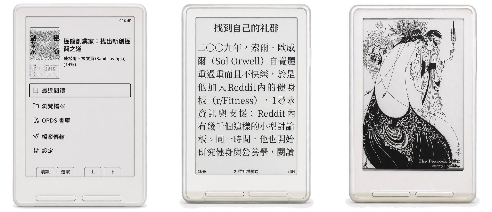
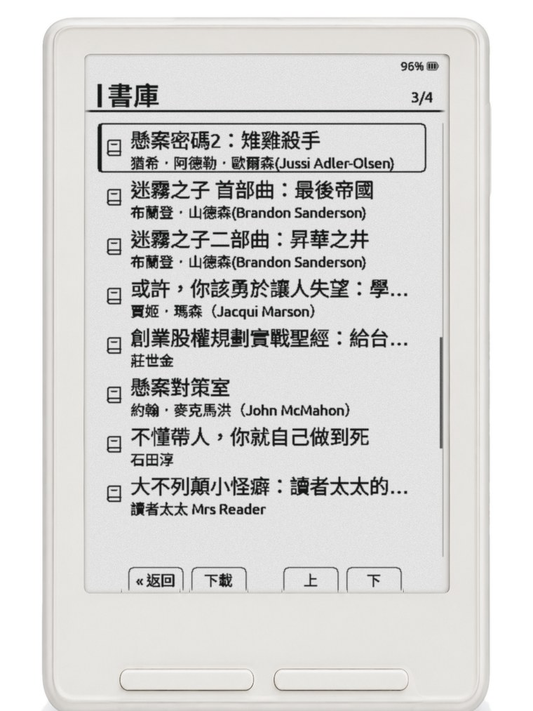

# CrossMosa

**終於，你的 X3 能好好讀中文了。**

給 Xteink X3 的繁體中文系統——免費、開源，刷一次機就有。

**快速前往:**
[**這一版更新了什麼**](CHANGELOG.md) ·
[安裝](#安裝) ·
[字型](docs/fonts.md) ·
[螢幕停住了？](docs/rescue.md) ·
[與原版的差異](#與原版-crosspoint-的關係) ·
[下載](https://github.com/anki630/crossmosa/releases/latest) ·
[English](#crossmosa-english)



**書名說中文。選單說中文。**
連「憨」「璐」「羣」「倂」這些字，它都認得。書名不再是一排 □□□。

**你的書，你挑字體。**
明體、黑體、硬筆楷書。小字看不清，還有大字版。

**翻頁，跟得上眼睛。**
你讀這一頁的時候，下一頁的字已經備好了。

**讀到最精彩的一章，它不會重開機。**

**闔上機器，它是一幅畫。**
50 張世界名畫輪流待機。今天梵谷，明天北齋。

你還可以逛 OPDS 書庫、用瀏覽器傳書進去、換介面主題、加書籤、截圖。

---

刷韌體、複製字型、開機切中文。三步，今晚就能開始讀。

刷壞了也回得來。SD 卡救援模式隨時換回任何韌體，第一次刷機不用接電腦。

免費，開源，個人專案。

---

## 這是什麼

版本:[`2.0.1`](https://github.com/anki630/crossmosa/releases/latest)

> 🧪 **想試新東西？** 測試版 **2.1.0-beta.4** 有直排閱讀，按電源鍵是睡眠、再按一次就回到你離開的地方。
> 它是預發佈版，**第一次刷 CrossMosa 的人請不要從它開始**——先刷 2.0.1，確認一切正常之後再換上來。
> 詳情見 [2.1.0-beta.4 的說明](https://github.com/anki630/crossmosa/releases/tag/v2.1.0-beta.4)。

**我該刷哪一版？**

| | |
|---|---|
| **第一次刷，或不知道該選哪一版** | **刷 2.0.1。** 它會自己認出你的螢幕是哪一種，新舊機器都認得。刷舊版才要碰運氣——比較新的 X3 刷上去，畫面就不會再更新 |
| **已經在用 1.0／1.1／1.2** | 建議升:換一章從十秒左右變成一兩秒，翻頁更順，書裡的圖也更少出不來 |
| **已經在用 2.0.0** | 建議升:書名裡的黑方塊少了很多，逛 OPDS 書單也不會偶爾當機。設定與進度都不受影響 |

CrossMosa 是原版 [CrossPoint](https://github.com/crosspoint-reader/crosspoint-reader)（本分支的來源專案，開發圈慣稱 upstream）的繁體中文分支。
原版是通用的開源電子書系統，支援兩種機型、二十幾種介面語言、多種檔案格式。
CrossMosa 把範圍收窄，專心做三件事:

1. **介面與內文都是繁體中文**——選單、檔名、書名、OPDS 書庫、書的內文。
2. **閱讀優先**。凡是會讓翻頁掉字、讓長章節排不出來的東西，一律讓路。
3. **只針對 X3 調校**。原版同時支援 X3 與 X4;本分支的顯示、記憶體與字型全部照 X3 實測而定。

這是個人專案，不是產品。**沒有任何隸屬於 Xteink 或原版 CrossPoint 專案的關係。**



---

## ☕ 覺得好用的話

CrossMosa 是下班後的個人專案。如果它讓你的 X3 變好用了，幾種讓我開心的方式:

- 到 [Discussions](../../discussions) 留句話，說說你拿它讀了什麼書——**這是我最想看的**。
- 推薦給也有 X3 的朋友。
- 請我喝杯咖啡（連結籌備中）——不影響任何功能，純粹讓下一個版本寫得更有勁。

回報缺字或問題，一樣歡迎開 Issue。

---

## 安裝

三步，順的話十分鐘。

1. **刷韌體** — 把 `update.bin` 放進 SD 卡根目錄，關機後按住左側「上一頁」鍵 ＋ 電源鍵。
2. **複製字型** — 把字型資料夾放進 SD 卡的 `/.fonts/`。沒有字型，中文書會整頁都是方塊。
3. **開機** — 設定 → 閱讀器 → 閱讀字型，選剛剛那套。

**第一次刷之前，請先讀 [首次安裝](docs/install.md)。** 那裡有風險、備份，和三種刷機方法。

| | |
|---|---|
| [首次安裝](docs/install.md) | 完整步驟、三種刷機方法 |
| [更新到新版](docs/update.md) | 已經在用 CrossMosa |
| [螢幕停住了](docs/rescue.md) | 刷完畫面不動 |
| [刷不進去怎麼辦](docs/flash-troubleshooting.md) | 出現「更新中」卻退回 |
| [字型](docs/fonts.md) | 選哪一套、大字版、遇到方塊字 |
| [把書放進去](docs/books.md) | 拔卡、瀏覽器、OPDS、Calibre |
| [換待機壁紙](docs/wallpaper.md) | 50 張世界名畫 |

---

## 自行建置

```bash
git submodule update --init --recursive --depth 1   # freeink-sdk 是 submodule,缺了會 link 失敗
pip install platformio
export SOURCE_DATE_EPOCH=$(git log -1 --format=%ct)  # 見下方「可重現建置」
pio run -e gh_release                                # 產物在 .pio/build/gh_release/firmware.bin
```

### 可重現建置

**發佈的映像檔（`update.bin`，即建置產物 `firmware.bin` 改名）是逐位元組可重現的**——同一個 commit、同一組釘住版本的相依套件，
任何人都能建出 sha256 完全相同的檔案。條件只有一個:**必須設 `SOURCE_DATE_EPOCH`**。

不設的話，`__DATE__` / `__TIME__` 會把建置當下的時刻編進 binary(其中一處還在 Arduino
core 裡，不是本專案能改的)，兩次建置就會差幾十個位元組。設了之後 GCC 會用這個值取代那兩個
巨集，同時本專案的網頁資產壓縮也會用它當 gzip 的 mtime。

**每個 Release 都會公佈當次使用的 `SOURCE_DATE_EPOCH` 與 firmware 的 sha256。**
打包腳本 [`scripts/mk-release.sh`](scripts/mk-release.sh) 預設直接取 release commit 自己的
時間戳(`git log -1 --format=%ct`)，所以只要 checkout 同一個 tag 就會自動得到同一個值。
機制與判讀方式寫在 [`docs/reproducible-builds.md`](docs/reproducible-builds.md)。

---

## 與原版 CrossPoint 的關係

**CrossMosa 的一切都建立在 [CrossPoint](https://github.com/crosspoint-reader/crosspoint-reader) 上面。**
閱讀引擎、EPUB 解析、排版、活動框架、網頁介面、OPDS、Calibre 流程——這些都是原版寫的，
本分支只是在上面做中文化與 X3 特化。

- 原版作者:**Dave Allie** 與 CrossPoint 貢獻者們。授權 MIT,`LICENSE` 原封保留。
- 原版的錯誤回報請發到[原版 repo](https://github.com/crosspoint-reader/crosspoint-reader/issues)，
  不要發到這裡;本 repo 只處理本分支自己改壞的東西。
- **想要完整功能的人應該用原版**，不是用這個分支。

### 與原版的差異

**已移除**（不是關閉，是程式碼層面拔掉入口讓連結器回收，換 flash 空間給中文字型）:

| 移除 | 原因 |
|---|---|
| English / 繁體中文以外的 **29 種 UI 語言** | 約 258 KB，換中文字型 |
| **KOReader 進度同步** | 沒有伺服器可同步 |
| **字典查詢**(StarDict) | 未使用 |
| **OTA 線上更新** | 會指向原版的 release 把本分支蓋掉;**SD 卡韌體更新保留** |
| **Classic / RoundedRaff 主題** | 字級與語系支援跟不上中文;留 Formosa、Formosa Extended 與 Formosa Pro |
| **非英文的斷字表**（9 種語言） | 中文不斷字，約 323 KB |
| **內建斜體字面** | 自動退回正體，約 544 KB |
| 內建閱讀字型縮成**單一 14px 備援** | 只在沒有 SD 字型時用得到，約 373 KB |
| **SMB2 伺服器**（iOS「檔案」App 直接管理 SD 卡） | 已移除。先前公開版預設就不編進發佈韌體；這一版連原始碼一併拿掉，無法再開編譯開關編回來。請改用網頁傳檔、Calibre、OPDS 或拔卡複製 |
| **BLE 翻頁遙控器** | 已移除。發佈韌體本來就沒有；這一版原始碼也不再保留，無法自編加回 |

**保留**:Calibre 無線推書（相容原版外掛生態）、網頁設定與傳檔、WebDAV、OPDS、
傾斜翻頁、螢幕截圖、按鍵重配、待機畫面。

---

## 免責聲明

- **本專案不提供任何書籍內容，也不內建任何書源。** 韌體與 Release 裡沒有書。
  請從正版管道取得電子書(無 DRM 的正版 EPUB:出版社或獨立書店直售、公共領域書庫、
  你自己的文件)，放進 SD 卡或自架書庫使用。請支持正版，尊重創作者。
- **刷機有風險，自負。** 刷第三方韌體可能讓裝置無法開機。**已經有實際變磚的案例，
  而且救援程序對部分機器無效——請假設有可能救不回來。**
  開始之前請先讀安裝章開頭的「刷機無法保證成功」與 USB-locked 注意事項:
  SD 救援模式在韌體卡住開機迴圈時進不去，部分機器的 USB 也沒有資料傳輸。
- **與 Xteink 無關，與原版 CrossPoint 專案也無隸屬關係。** 兩者都不為這個分支負責。
- **驗證主力是一台 UC8279 新批次 X3**，舊批次（UC8253）由使用者回報刷機成功。
  沒有 X4，沒有自動化的硬體測試。
  很多改動的驗證方式就是「用了幾天沒出事」。
- **沒有遙測。** 本韌體不會回報使用狀況給任何人。Wi-Fi 憑證、閱讀進度、書籤只存在你自己的
  SD 卡上(`/.crossmosa/`)。裝置只有在你主動要求時才連外:連 Wi-Fi 後對時(NTP)、
  你設定的 OPDS 伺服器、Calibre 無線連線。原版的 OTA 更新檢查已經移除，
  所以本韌體不會主動連任何本專案或原版的伺服器。
- 「AS IS」，無任何擔保，見 `LICENSE`。

---

## 授權

- 原版 CrossPoint:MIT,Copyright (c) 2025 Dave Allie（`LICENSE`，原封保留）。
- CrossMosa 的修改:MIT,Copyright (c) 2026 CrossMosa contributors。
- 內含的第三方程式庫與字型各有授權，**完整清單見 [`NOTICE.md`](NOTICE.md)**。
  ⚠️ 其中有 GPLv2 與 LGPL-2.1 的元件會連結進發佈的韌體 binary，
  請先讀 NOTICE 的「發佈義務」一節。

維護:**CrossMosa contributors**。

---
---


# CrossMosa (English)

**Jump to:**
[**What's new**](CHANGELOG.md) ·
[Install](docs/install.md) ·
[Fonts](docs/fonts.md) ·
[Screen frozen?](docs/rescue.md) ·
[Vs upstream](#relationship-to-upstream) ·
[Download](https://github.com/anki630/crossmosa/releases/latest)

**Finally, your X3 can read Traditional Chinese properly.**

**Traditional-Chinese-focused firmware for the Xteink X3 e-reader**, based on
[CrossPoint](https://github.com/crosspoint-reader/crosspoint-reader) 1.5.0.
Free, open source, one flash and it's yours.


**Titles in Chinese. Menus in Chinese.**
Including the uncommon characters real book titles use. No more rows of □□□.

**Your books, your typeface.**
Serif, sans, brush. Too small to read? There's a large-print pack.

**Page turns keep up with your eyes.**
While you read this page, the next page's glyphs are already loaded.

**The best chapter of the book won't reboot the device.**

**Close it and it's a painting.**
Fifty masterpieces take turns on the sleep screen. Van Gogh today, Hokusai tomorrow.

You can also browse OPDS libraries, send books over from a browser, switch themes,
bookmark, and take screenshots.

---

Flash the firmware, copy the fonts, boot and pick Chinese. Three steps, and you can start tonight.

If a flash goes wrong you can come back. SD rescue mode restores any firmware,
and the first flash needs no computer.

Free, open source, a personal project.

Version: `2.0.1` · [Download](https://github.com/anki630/crossmosa/releases/latest) · [Changelog](CHANGELOG.md)

> 🧪 **Want to try what's next?** Pre-release **2.1.0-beta.4** adds vertical (top-to-bottom) reading,
> and the power button now sleeps and resumes where you left off.
> **Don't start here if this is your first CrossMosa flash** — install 2.0.1 first.
> See the [2.1.0-beta.4 notes](https://github.com/anki630/crossmosa/releases/tag/v2.1.0-beta.4).

## What it is

A narrow fork of CrossPoint with one goal: read Traditional Chinese books well on the X3.
It trades away breadth (other languages, other formats, the X4) for Chinese typography,
a reading-first memory policy, and X3-specific display tuning.

Newer X3 units ship a different display controller. This build identifies it at boot, so both
the newer and the older batches work. If your screen already updates normally, you do not need to flash.

## Install

Three steps, about ten minutes.

1. **Flash the firmware** — put `update.bin` in the SD card root, power off, then hold the
   left-edge "previous page" key **+** the power button.
2. **Copy the fonts** — put the font folder into `/.fonts/` on the SD card. Without them,
   Chinese books render as boxes.
3. **Boot** — Settings → Reader → Reading Font, pick the family you just copied.

**Read [Install](docs/install.md) before your first flash.** It covers the risks, the backup
step, and all three flashing methods.

| | |
|---|---|
| [Install](docs/install.md) | Full steps, three flashing methods |
| [Update](docs/update.md) | Already running CrossMosa |
| [Screen stopped updating](docs/rescue.md) | Rescue procedure |
| [Fonts](docs/fonts.md) | Which family, large print, missing glyphs |

---

## Building

```bash
git submodule update --init --recursive --depth 1
export SOURCE_DATE_EPOCH=$(git log -1 --format=%ct)
pio run -e gh_release
```

**Builds are byte-for-byte reproducible** — but only if `SOURCE_DATE_EPOCH` is set, because
`__DATE__`/`__TIME__` otherwise bake the wall clock into the image (one of the two sites is in
the Arduino core, not ours to patch). Every release publishes the epoch it used together with
the firmware sha256; [`scripts/mk-release.sh`](scripts/mk-release.sh) defaults to the release
commit's own timestamp, so checking out the tag reproduces the value automatically. See
[`docs/reproducible-builds.md`](docs/reproducible-builds.md).

## Relationship to upstream

Everything here stands on **CrossPoint** by **Dave Allie** and its contributors (MIT;
`LICENSE` kept as-is). Report upstream bugs upstream. If you want the full feature set,
use upstream rather than this fork.

**Removed** (to reclaim flash for Chinese fonts): 29 UI languages beyond English and
Traditional Chinese, KOReader progress sync, StarDict dictionary,
the OTA updater (SD-card firmware update is kept), the Classic and RoundedRaff themes
(kept: **Formosa**, **Formosa Extended**, **Formosa Pro**),
non-English hyphenation tables, built-in italic faces, and all but one built-in reader font size.

**Also removed from the tree** (not merely disabled; they cannot be compiled back in):
the **SMB2 server** for the iOS Files app, and the **BLE page-turner remote**.
Use browser file transfer, Calibre, OPDS, or copy files onto the SD card instead.

## ☕ If it made your X3 better

Say hi in [Discussions](../../discussions) and tell me what you've been reading with it, tell a
friend with an X3, or buy me a coffee (link coming — it changes nothing about the firmware).
Issues for missing characters or bugs are welcome too.

## Disclaimer

This project ships **no book content and no book sources** — bring your own legally obtained, DRM-free EPUBs (publisher or indie-store direct sales, public-domain libraries, your own documents). Support the authors. Flash at your own risk; third-party firmware can leave a device unbootable. Not affiliated
with Xteink or upstream. Verified primarily on **one newer-batch UC8279 X3**; an
older-batch (UC8253) unit was **flashed successfully by a user**. No X4 — much of the verification is "used it for
a few days and nothing broke". **No telemetry**: credentials, progress and bookmarks stay on
your SD card, and the device only reaches the network when you ask it to (NTP after joining
Wi-Fi, your own OPDS server, Calibre). The upstream OTA update check is removed, so this
firmware never contacts a project server on its own. Provided AS IS, see `LICENSE`.

## Licensing

Upstream CrossPoint: MIT © 2025 Dave Allie. CrossMosa modifications: MIT © 2026 CrossMosa
contributors. Bundled third-party code and fonts carry their own licences — see
[`NOTICE.md`](NOTICE.md). ⚠️ Some components linked into the released firmware binary are
GPLv2 and LGPL-2.1; read the "Distribution obligations" section of NOTICE first.

Maintained by **CrossMosa contributors**.
