# CrossMosa

**中文書，就該這樣讀。**

為 Xteink X3 與 X4 打造。裝好之後，拿起來就是中文。 
零碎時間已經夠少了，不該花在跟機器搏鬥上。

**[下載 X3 版](https://github.com/anki630/crossmosa/releases/latest)** ·
**[下載 X4 版](https://github.com/anki630/crossmosa/releases/latest)** ·
[怎麼安裝？三步驟](#開始使用) ·
[English](#crossmosa-english)

免費開源・機器免接電腦 
觸控的 X4 Pro 不適用。

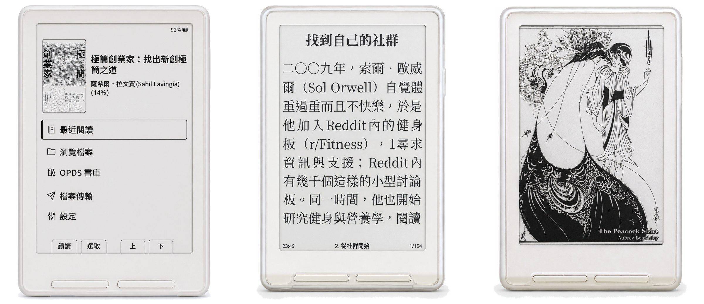

## 你買它是為了讀中文書，結果打開是這樣

整頁都是方塊。裝好 CrossMosa，選單是中文，書頁清清楚楚。差別，看圖就好。

| 裝好之前 | 裝好之後 |
|:---:|:---:|
| 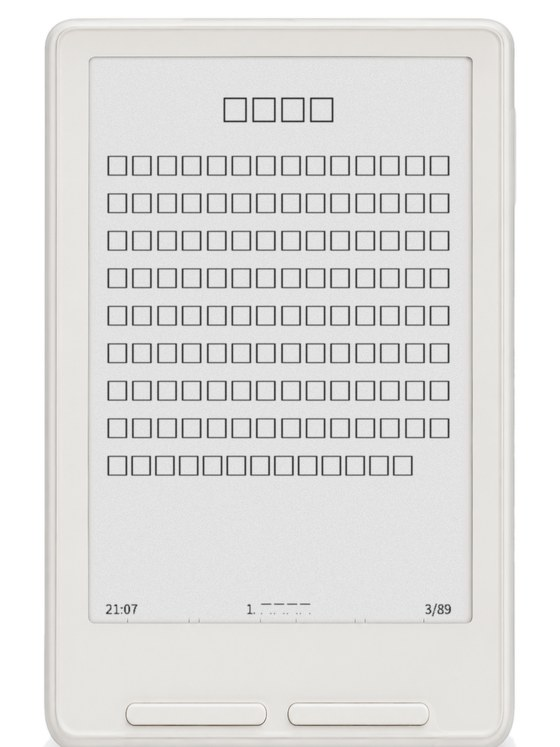 | 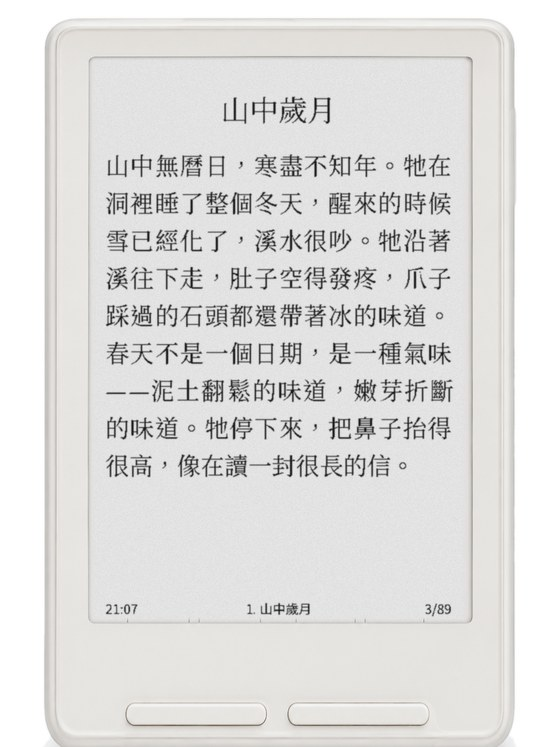 |

## 孩子，也能自己讀

還不認得的字，看旁邊的注音就會念。破音字，也會照詞來標。 
睡前、週末、坐車的時候，拿起來就能讀完一本。

沒有遊戲，沒有廣告，也沒有通知。孩子拿起來，就是讀書。

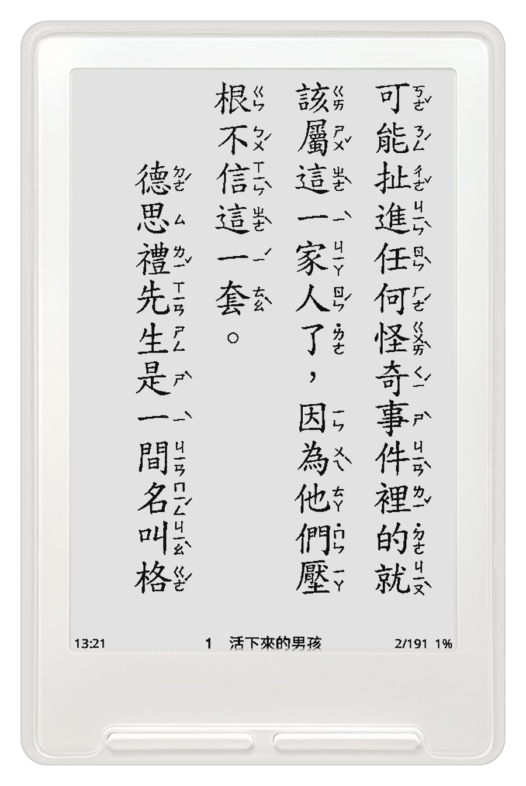

注音字型需要 2.1.0 以後的韌體。[下載注音字型 →](https://github.com/anki630/crossmosa/releases/tag/zhuyin-2026-09)

## 換一套字，換一種心情

明體耐讀，黑體清楚，圓體柔和，硬筆楷書像手寫。給孩子有注音，給爸媽有大字版。字型放在 SD 卡上，隨時可以換。

| 明體 | 黑體 | 圓體 |
|:---:|:---:|:---:|
| 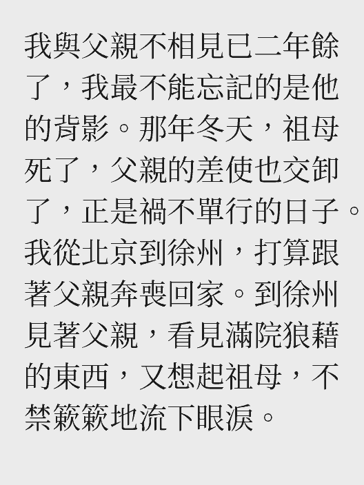 長篇首選 |  字小也清楚 | 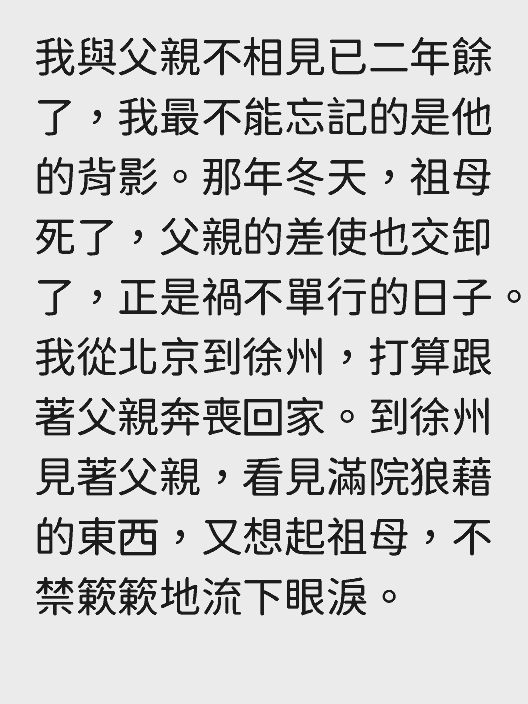 筆畫圓潤，看久不累 |
| **硬筆楷書** | **注音楷書** | **大字版** |
|  像原子筆寫在紙上 | 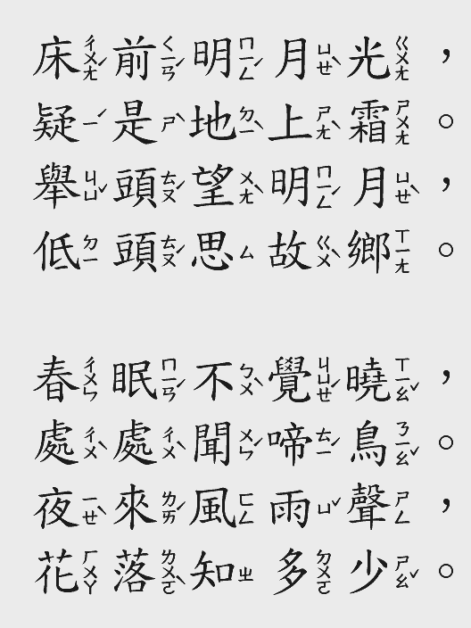 破音字也照詞來標 |  明體、黑體、圓體都有 |

看直排的樣子

| 明體 | 黑體 | 圓體 |
|:---:|:---:|:---:|
|  | 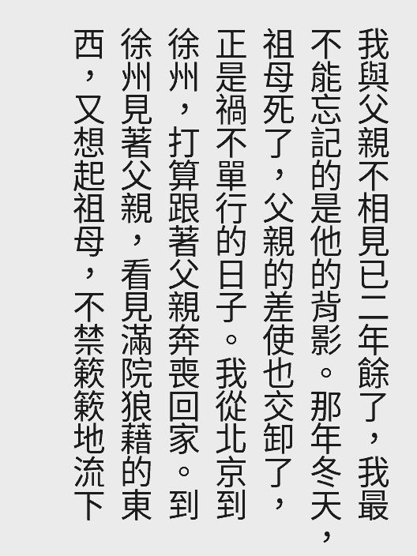 | 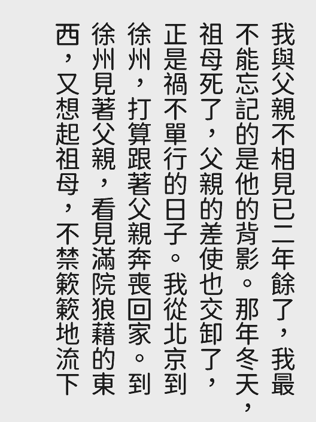 |
| **硬筆楷書** | **注音楷書** | **大字版** |
| 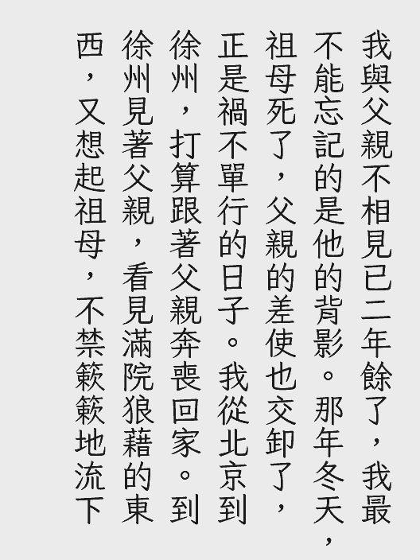 |  |  |

樣張是模擬畫面：用機器上的字型檔，照螢幕原本的解析度排出來。範文為朱自清〈背影〉、李白〈靜夜思〉、孟浩然〈春曉〉。

## 零碎時間，拿起來就讀

通勤、午休、睡前。你還在讀這一頁，下一頁已經備好；下次打開，從上次的地方繼續。

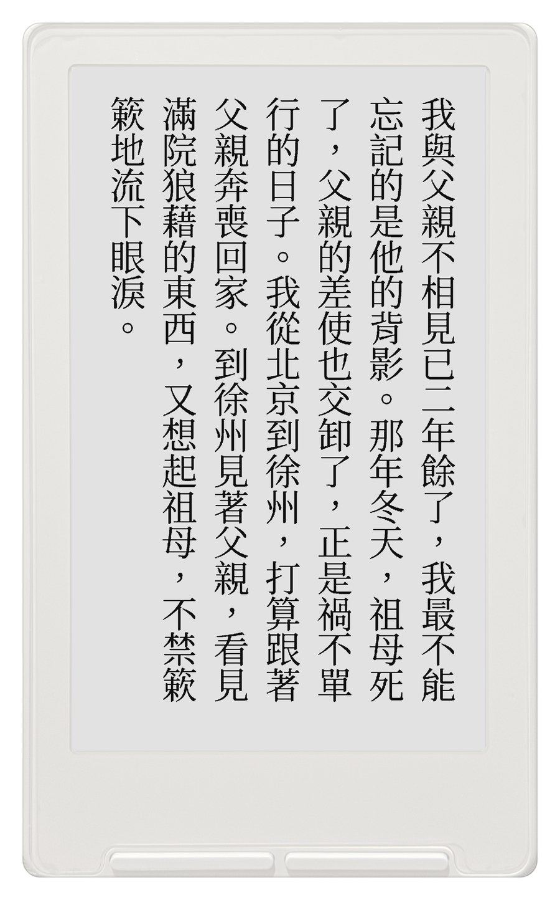

**直排的書，照直排讀。**由上而下、由右而左，像翻一本真正的書。

**註腳，一按就到。** 再按一下就回到原處。譯注多的書，終於好讀了。

**書，傳過去就好。** 打開瀏覽器，把書拖進去。書都在 Calibre 的話，機器也能直接連上你的書庫。

## 口袋裡的小美術館

闔上的時候，螢幕上是一幅世界名畫。今天梵谷，明天北齋。

  
  
  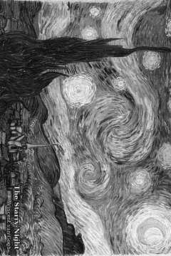
  
  
  

<a href="https://anki630.github.io/crossmosa/masterpieces.html">每一幅畫的故事 →</a>

## 三步驟，今晚就能開始讀

機器你已經有了，SD 卡就插在上面。剩下的只有三步。

**適用機型**：Xteink X3、X4。觸控的 X4 Pro 和其他機型都不適用。

**該下載哪一版？** 下載[最新的正式版](https://github.com/anki630/crossmosa/releases/latest)就好，X3、X4 都能直接刷。想先試還在測試的新功能，可以到[下載頁](https://github.com/anki630/crossmosa/releases)找 Beta 版。

1. **刷機**（只有第一次）：下載 `update.bin`，放進 SD 卡最外層，插回機器。關機後，按住下面兩顆鍵開機，看到載入畫面就放手。等它自己重新開機，就完成了。
   - **X3**：左側的上一頁鍵＋電源鍵
   - **X4**：右側上面那顆鍵＋電源鍵。沒有反應的話，接上 USB 電源再試一次。
2. **放字型**：下載[字型包](https://github.com/anki630/crossmosa/releases/tag/fonts-2026-09)，在 SD 卡最外層建一個 `fonts` 資料夾，把字型包裡的資料夾放進去。沒有字型，書會顯示成方塊。
3. **開始讀**：在剛剛下載韌體的那一頁，下載使用手冊 `CrossMosa.epub`，放進 SD 卡。到「設定 → 閱讀器 → 閱讀字型」選一套字型，打開手冊，一邊讀一邊按。

**以後更新，不用重刷。** 把新版傳進機器，到「設定 → 系統 → SD 卡韌體更新」選它就好，不用再按鍵開機。[詳細步驟](docs/update.md)

第一次刷機之前，請先讀[安裝說明](docs/install.md)裡的注意事項。刷機有風險，而且不是每一次都救得回來。

| 我想要 | 看這裡 |
|---|---|
| 第一次安裝 | [首次安裝](docs/install.md) |
| 更新到新版 | [更新到新版](docs/update.md) |
| X3 刷完畫面不動 | [螢幕停住了](docs/rescue.md) |
| 刷不進去 | [刷不進去怎麼辦](docs/flash-troubleshooting.md) |
| 挑字型、裝大字版、給孩子的注音 | [字型](docs/fonts.md) |
| 把書放進機器 | [把書放進去](docs/books.md) |
| 換桌布 | [桌布](docs/wallpaper.md) |
| 刷回原廠系統 | [社群整理的步驟](https://pocketink.io/firmware/recovery/)（英文） |

## 猶豫的話，先看這裡

支援哪些機器？

Xteink X3 和 X4。觸控的 X4 Pro 不支援。

每次更新都要重刷嗎？

不用。只有第一次要按鍵刷機。之後出新版，用手機的瀏覽器把它傳進機器，到「設定 → 系統 → SD 卡韌體更新」選它就好，全程不用接線。

不太會用電腦，也裝得起來嗎？

裝得起來。用電腦或手機把檔案放進 SD 卡，再按住兩顆鍵開機就好，機器不用接線。

會把機器刷壞嗎？

刷機有風險，而且不是每一次都救得回來。開始之前，請先讀完[安裝說明](docs/install.md)裡的注意事項。

可以刷回原廠系統嗎？

可以。社群整理了[刷回原廠的步驟](https://pocketink.io/firmware/recovery/)（英文）：機器接得上電腦的話，用 CrossPoint 的刷機網站；USB 被鎖住的 X3，改用 SD 卡和原廠的更新檔。

要錢嗎？

免費，開源。

書從哪裡來？

CrossMosa 不提供書。請向正版管道購買沒有 DRM 的電子書，再用瀏覽器傳進機器。有 DRM 的書，這台機器讀不了。

跟原版 CrossPoint 差在哪？

CrossPoint 是很好的開源起點。CrossMosa 在它上面，把中文閱讀做完整。

## 為什麼會有它

我是電子書閱讀器的愛用者。有工作、有小孩，能讀書的時間都是擠出來的零碎片段——通勤的路上、孩子睡著後的半小時。X3 這種放得進口袋的機器，就是為這些片段準備的。

但買來才發現，它不是為中文讀者做的：選單是英文，中文書打開是滿頁方塊。零碎時間已經夠少了，不該再花在跟機器搏鬥上。

所以我從開源的 CrossPoint 出發，為自己改了一版。一版一版地改，改到我覺得可以拿出來了。

它叫 CrossMosa：Cross 來自它的起點，Mosa 來自 Formosa。開機畫面上那隻是台灣黑熊，牠頭上有一彎月牙。

如果你的閱讀時間也是擠出來的，這一版就是為你調的。

—— [anki630](https://github.com/anki630)，CrossMosa 維護者

## 如果它讓你的閱讀器變好用了

推薦給也有 X3、X4 的朋友；到[討論區](../../discussions)說說你讀了什麼書；或請維護者喝杯咖啡（連結籌備中）。
缺字或遇到問題，歡迎[回報](../../issues)。

**[下載 X3 版](https://github.com/anki630/crossmosa/releases/latest)** ·
**[下載 X4 版](https://github.com/anki630/crossmosa/releases/latest)**

**接下來，把零碎時間還給書。**

---

## 給開發者

- [自行建置、與原版 CrossPoint 的差異、介面字型怎麼做](docs/developers.md)
- [變更紀錄](CHANGELOG.md)
- [第三方元件與授權](NOTICE.md)

CrossMosa 建立在 [CrossPoint](https://github.com/crosspoint-reader/crosspoint-reader) 上面，原版作者是 Dave Allie 與 CrossPoint 的貢獻者們。原版的問題，請回報到[原版的專案](https://github.com/crosspoint-reader/crosspoint-reader/issues)。

## 免責聲明

- 本專案不提供任何書籍內容，也不內建任何書源。請從正版管道取得沒有 DRM 的電子書，支持正版，尊重創作者。
- 刷機有風險，風險自負。已經有機器變磚、照著救援步驟也沒救回來的案例。開始之前，請先假設它可能救不回來，詳見[安裝說明](docs/install.md)。
- 與 Xteink 無關，與原版 CrossPoint 專案也沒有隸屬關係。
- 測試用的是維護者自己的 X3 與 X4，沒有自動化的硬體測試。
- 沒有遙測。設定、閱讀進度和書籤只存在你的 SD 卡上。機器不會主動連到本專案或原版的伺服器，只有在你要求時才會連網，例如連上 Wi-Fi 後對時、連你設定的書庫。
- 依現狀提供，不附任何擔保，詳見 `LICENSE`。

## 授權

- 原版 CrossPoint：MIT，Copyright (c) 2025 Dave Allie（`LICENSE` 原封保留）。
- CrossMosa 的修改：MIT，Copyright (c) 2026 CrossMosa contributors。
- 內含的第三方程式庫與字型各有授權，完整清單見 [`NOTICE.md`](NOTICE.md)。其中有 GPLv2 與 LGPL-2.1 的元件會一起編進發佈的韌體，要再散布的話，請先讀 NOTICE 的「發佈義務」。

維護：CrossMosa contributors。

---
---

# CrossMosa (English)

**Chinese books, the way they should be read.**

Made for the Xteink X3 and X4. Install it, and the whole device speaks Chinese. 
Reading time is short enough. It shouldn't go to fighting the device.

**[Download for X3](https://github.com/anki630/crossmosa/releases/latest)** ·
**[Download for X4](https://github.com/anki630/crossmosa/releases/latest)** ·
[How to install: three steps](#getting-started)

Free and open source · No computer connection needed 
Not for the touchscreen X4 Pro.

## You bought it to read Chinese books. Then you opened one.

A whole page of boxes. With CrossMosa, the menus are in Chinese and every page is clear. The pictures say the rest.

| Before | After |
|:---:|:---:|
|  |  |

## Children can read on their own

Zhuyin sits beside every character, so new words can be sounded out. Characters with more than one reading get the one that fits the word. 
At bedtime, on weekends, in the car: pick it up and read a whole book.

No games, no ads, no notifications. When children pick it up, they read.

The zhuyin font needs firmware 2.1.0 or later. [Get the zhuyin font →](https://github.com/anki630/crossmosa/releases/tag/zhuyin-2026-09)

## A new typeface, a new mood

Serif for long reads, sans for clarity, rounded for comfort, handwritten for warmth. Zhuyin for children, large print for parents. The fonts live on the SD card, so you can switch anytime.

| Serif | Sans serif | Rounded |
|:---:|:---:|:---:|
|  Made for long reads |  Clear even when small |  Soft strokes, easy on the eyes |
| **Handwritten** | **Zhuyin** | **Large print** |
|  Like ballpoint pen on paper |  Readings that fit the word |  In serif, sans serif, and rounded |

See them in vertical text

| Serif | Sans serif | Rounded |
|:---:|:---:|:---:|
|  |  |  |
| **Handwritten** | **Zhuyin** | **Large print** |
|  |  |  |

The samples are simulated: the device's own font files, laid out at the screen's native resolution. Texts: Zhu Ziqing's "Back View", Li Bai's "Quiet Night Thoughts", and Meng Haoran's "Spring Morning".

## Spare moments, ready to read

On the commute, at lunch, before bed. While you read this page, the next one is already prepared. Open it later and pick up where you left off.

**Vertical books, read vertically.** Top to bottom, right to left, like turning the pages of a real book.

**Footnotes, one press away.** Press again to return to where you were. Books full of translator's notes are finally easy to read.

**Books, just send them over.** Open a browser and drag them in. If your books are in Calibre, the device can connect to your library directly.

## A small museum in your pocket

When you close it, the screen shows a famous painting. Van Gogh today, Hokusai tomorrow.

  
  
  
  
  
  

<a href="https://anki630.github.io/crossmosa/masterpieces.html">See all fifty paintings →</a>

## Three steps. Start reading tonight.

You already have the device, and the SD card is already in it. Three steps are all that's left.

**Compatible devices:** Xteink X3 and X4. The touchscreen X4 Pro and other devices are not supported.

**Which version should I download?** Just get the [latest release](https://github.com/anki630/crossmosa/releases/latest); it works on both the X3 and X4. To try new features that are still being tested, look for the beta on the [releases page](https://github.com/anki630/crossmosa/releases).

1. **Flash** (first time only): Download `update.bin`, put it in the root of the SD card, and put the card back. Turn the device off, then hold the two keys below while powering it on, and let go when the loading screen appears. It restarts by itself when it's done.
   - **X3:** the previous-page key on the left edge + the power button
   - **X4:** the upper key on the right edge + the power button. If nothing happens, connect USB power and try again.
2. **Add fonts:** Download the [font pack](https://github.com/anki630/crossmosa/releases/tag/fonts-2026-09). Create a `fonts` folder in the root of the SD card and put the folders from the pack inside it. Without fonts, books show up as boxes.
3. **Start reading:** The device starts in Traditional Chinese. To switch to English, go to 設定 → 系統 → 語言 → English. Choose a font under Settings → Reader → Reader Font Family. The release page also has a short manual, `CrossMosa.epub` (in Chinese): put it on the card, open it, and follow along.

**Later updates don't need a reflash.** Copy the new `update.bin` to the card, from a phone or computer browser with the device's File Transfer page or with a card reader, then go to Settings → System → SD Card Firmware Update and pick the file. No key combination. [Detailed steps](docs/update.md#updating-english)

Before your first flash, read the precautions in the [install guide](docs/install.md#install-english). Flashing carries risks, and recovery is not always possible.

| I want to… | Go to |
|---|---|
| Install CrossMosa for the first time | [Install](docs/install.md#install-english) |
| Update CrossMosa | [Updating](docs/update.md#updating-english) |
| Fix an X3 screen that stopped updating | [Screen stopped updating](docs/rescue.md#screen-stopped-updating-rescue-english) |
| Fix a flash that won't go through | [Flash troubleshooting](docs/flash-troubleshooting.md#flash-troubleshooting-english) |
| Choose fonts, install large print, or add zhuyin | [Fonts](docs/fonts.md#fonts-english) |
| Check why characters are missing | [Missing characters](docs/fonts.md#character-set-limits-english) |
| Add books | [Adding books](docs/books.md#adding-books-english) |
| Change the wallpaper | [Wallpapers](docs/wallpaper.md#wallpapers-english) |
| Restore the stock firmware | [Community recovery guide](https://pocketink.io/firmware/recovery/) |

## Still deciding?

Which devices are supported?

The Xteink X3 and X4. The touchscreen X4 Pro is not supported.

Do I have to reflash for every update?

No. Only the first install uses the key combination. When a new version comes out, send it to the device from your phone's browser, then go to Settings → System → SD Card Firmware Update and pick it. No cable needed.

I'm not good with computers. Can I still install it?

Yes. Put the files on the SD card with a computer or a phone, then hold two keys while turning the device on. The device never needs to be connected to anything.

Can flashing break my device?

Flashing carries risks, and recovery is not always possible. Before you begin, read the precautions in the [install guide](docs/install.md#install-english).

Can I go back to the stock firmware?

Yes. The community has a [guide to restoring the stock firmware](https://pocketink.io/firmware/recovery/). If your device connects to a computer, use CrossPoint's web flasher; on an X3 with locked USB, use the SD card and the stock update file.

Does it cost anything?

It's free and open source.

Where do the books come from?

CrossMosa doesn't provide books. Buy DRM-free ebooks from legitimate stores, then send them to the device from a browser. Books with DRM can't be read on this device.

How is it different from the original CrossPoint?

CrossPoint is a great open-source starting point. CrossMosa builds on it and makes Chinese reading complete.

## Why it exists

I love e-readers. Between work and kids, my reading time comes in scraps: the commute, the half hour after the kids fall asleep. A pocket-sized device like the X3 is made for those moments.

Then I bought one and found it wasn't made for Chinese readers. The menus were in English, and Chinese books opened as pages of boxes. Reading time is short enough. It shouldn't go to fighting the device.

So I started from the open-source CrossPoint and made a version for myself. I kept refining it, one version after another, until it felt ready to share.

It's called CrossMosa: Cross from where it started, Mosa from Formosa. The animal on the startup screen is a Formosan black bear, with a crescent moon above it.

If your reading time also comes in scraps, this was made for you.

— [anki630](https://github.com/anki630), CrossMosa maintainer

## If it made your e-reader better

Tell a friend who has an X3 or X4; tell me what you're reading in [Discussions](../../discussions); or buy the maintainer a coffee (link coming).
Missing characters or other problems are welcome as [issues](../../issues).

**[Download for X3](https://github.com/anki630/crossmosa/releases/latest)** ·
**[Download for X4](https://github.com/anki630/crossmosa/releases/latest)**

**Now give your spare moments back to books.**

---

## For developers

- [Build instructions, differences from CrossPoint, and interface font details](docs/developers.md#for-developers-english)
- [Changelog](CHANGELOG.md)
- [Third-party components and licenses](NOTICE.md)

CrossMosa is built on [CrossPoint](https://github.com/crosspoint-reader/crosspoint-reader) by Dave Allie and the CrossPoint contributors. Report upstream issues to the [CrossPoint project](https://github.com/crosspoint-reader/crosspoint-reader/issues).

## Disclaimer

- This project provides no book content and includes no book sources. Obtain DRM-free ebooks through legitimate channels. Support legitimate publishing and respect creators.
- Flashing carries risks, which you accept yourself. Devices have been bricked, and some could not be recovered even with the rescue steps. Before you begin, assume recovery may not be possible. See the [install guide](docs/install.md#install-english).
- This project is not affiliated with Xteink and is not part of the upstream CrossPoint project.
- Testing is done on the maintainer's own X3 and X4. There is no automated hardware testing.
- There is no telemetry. Settings, reading progress, and bookmarks stay on your SD card. The device never contacts this project's or the upstream project's servers on its own; it goes online only when you ask it to, for example to set the clock after joining Wi-Fi or to reach a library you configured.
- Provided as is, without warranty. See `LICENSE`.

## License

- Upstream CrossPoint: MIT, Copyright (c) 2025 Dave Allie. Its `LICENSE` is kept unchanged.
- CrossMosa modifications: MIT, Copyright (c) 2026 CrossMosa contributors.
- Bundled third-party libraries and fonts have their own licenses; the complete list is in [`NOTICE.md`](NOTICE.md). Components under GPLv2 and LGPL-2.1 are built into the released firmware. Before redistributing it, read section 2 of NOTICE (distribution obligations; the file is in Chinese).

Maintained by CrossMosa contributors.
