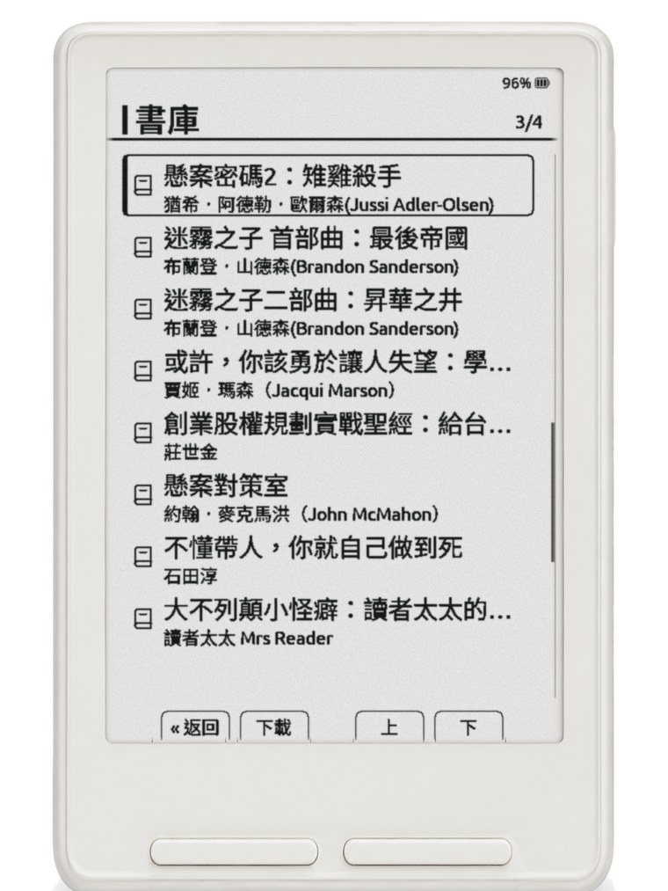

# 把書放進去

**用瀏覽器傳，不用拔卡**

1. 在機器的主畫面選「檔案傳輸」。
2. 選「加入網路」連上家裡的 Wi-Fi。附近沒有 Wi-Fi 的話，選「建立熱點」，讓手機或電腦連上機器的網路。
3. 手機或電腦的瀏覽器打開 `http://crossmosa.local`，把書拖進去。

**直接複製**：把 SD 卡拔下來，用讀卡機複製。大檔案用這個最穩。

**用 Calibre 管書的話**

- **Calibre 無線傳書**：在機器的「檔案傳輸」選「Calibre 無線傳書」，照螢幕上的設定步驟在電腦的 Calibre 裡連上機器，就能把書直接送過去。
- **主畫面的「OPDS 書庫」**：先到「設定 → 系統 → OPDS 伺服器」加入你的書庫網址，就能在機器上瀏覽、下載、開書。Calibre 的書庫網址後面要加 `/opds`。

書請從正版管道取得，選沒有 DRM 的電子書。本專案不提供、也不代找書籍內容。

---

# Adding books (English)

**Transfer books through a browser without removing the card**

1. Select File Transfer on the device’s Home screen.
2. Select Join a Network to connect to your home Wi-Fi. If no Wi-Fi network is available, select Create Hotspot, then connect your phone or computer to the device’s network.
3. Open `http://crossmosa.local` in a browser on your phone or computer. Drag your books onto the page.

**Copy books directly:** Remove the SD card and copy files with a card reader. This is the most reliable method for large files.

**If you manage books with Calibre**

- **Calibre Wireless:** Under File Transfer on the device, select Calibre Wireless. Follow the on-screen setup instructions to connect from Calibre on your computer, then send books directly to the device.
- **OPDS Browser on the Home screen:** First open Settings → System → OPDS Servers and add your library URL. You can then browse, download, and open books on the device. Add `/opds` to the end of a Calibre library URL.

Obtain books from authorized sources and choose DRM-free editions. This project does not provide books or help locate book content.
