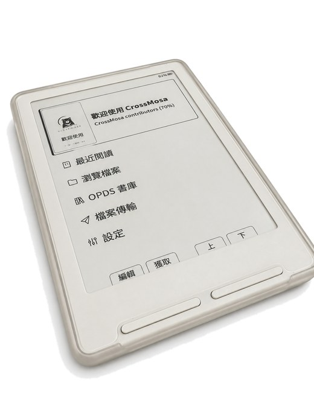

# 字型

CrossMosa 的中文分成兩套字型，各有各的地盤：

- **介面字型**編在韌體裡（書名、選單、目錄），換 SD 卡改不了。
- **內文字型**在 SD 卡上（書的內文），想換隨時換，不必重刷。

## 五套內文字型，選哪一套

| 字型 | 風格 | 漢字涵蓋 | 大小 | 說明 |
|---|---|---|---|---|
| **NotoSerifTC** | 明體 | 27,950 | 88 MB | 建議先裝這套 |
| **NotoSansTC** | 黑體 | 27,950 | 85 MB | 有粗體，1-bit 下筆畫最穩 |
| **Iansui** 芫荽 | 硬筆楷書 | 27,950 | 41 MB | 只有 Regular（粗體會退回一般字） |
| **GuanKiapTsingKhai-90** 原俠正楷 | 楷書·**偽直排** | 27,950 | 41 MB | 字形預先轉了 90 度，見下 |
| IBMPlexSansTC | 黑體 | 27,950 | 84 MB | 保留的舊選項 |

**五套都收了完整的中文字**——台語文、古文、人名的冷僻字以前會變黑框，現在都有字。
2.0.1 又補上了電子書實際會用到的符號:圈圈數字 `① ㈠`、注音 `ㄅㄆㄇ`、
**直排標點 `︿ ﹀ ﹃ ﹄`**、方框幾何 `─ ■ ○ ☆`，以及 CJK 擴充 A 整個區塊。
⚠️ **2.0.1 之前下載過的請重新下載**，否則那些字仍然是方塊。

## 看不清小字:大字版

另外下載 `crossmosa-2.0.1-sd-fonts-large.zip`,裡面是黑體與明體的大字版，
字級 **24 / 26 / 28**，裝法完全一樣。

字太大反而不好讀——真正決定舒不舒服的是**一頁剩幾個字**:
22pt 一頁約 138 字、28pt 剩 85 字（翻頁量 1.6 倍）。再往上翻頁會多到讓人分心，所以停在 28。

**只裝一套也可以**——空間有限就先裝 `NotoSerifTC`。五套全裝約 340 MB，
但**每個字級是獨立檔案**，只複製你要的那一個就好。
不影響 RAM:字型是按需從 SD 讀的，不會整份載進記憶體。

> **想直排讀中文（2.0.x 的作法）**:選 `GuanKiapTsingKhai-90`，再把螢幕轉成橫向，
> 中文就會由上而下、由右而左排列。它的字形是**預先轉了 90 度**的，
> 所以正常橫排時選它會整頁躺著——只在要直排時用。
>
> ⚠️ **2.1 之後不要這樣做。** 2.1 有真正的直排（設定 → 閱讀器 → 文字設定 → 版面 → 文字方向），
> 而真直排配上這套預轉 90 度的字型會讓**每個字躺著**。要楷書請選 `Iansui`（芫荽）——
> 原俠正楷的主體本來就是芫荽。

**SD 卡要求**:FAT32 或 exFAT。**字型資料夾名稱不可以有空格**（原版已知會 crash，用底線）。

**順手做的步驟 2.5**:firmware zip 裡有一本《歡迎使用 CrossMosa》，把它一起複製進 SD 卡。
十三章、約十分鐘，每一章結尾都叫你按一顆鍵，讀完這台機器就會用了（含電源鍵的五種本事與救援刷機）——刷完之後第一本就讀它。

---

# 遇到方塊字

這是本分支最需要事先講清楚的取捨。

**內建 UI 字型涵蓋 7,973 個漢字**:BIG5 一級全部，加上掃描整個電子書庫挑出來的常用字。
**不是全部的中文字。** 完整的 BIG5 有 13,060 字，Unicode 的中日韓統一表意文字更多。

沒被涵蓋到的字，會在**選單、檔名、書名、OPDS 書目、章節目錄**顯示成方塊 □。

### 還是會踩到的情況

**罕用字，尤其是 BIG5 範圍外的**——很多台灣人名用字根本不在 BIG5 裡。

2.0.1 補了 496 個字，挑法也換了:以前是照 BIG5 的字頻表挑，
現在改成**掃整個電子書庫的內文**，看真正會出現在書名和檔名裡的是哪些字。
但只要有人的書用到沒被掃到的字，還是會是方塊。**碰到就回報，補字是例行維護。**

### 書的內文不受影響

UI 字型與內文字型是**完全獨立的兩套**。書的內文走 SD 卡字型，
而五套 SD 字型都收了 **27,950 個漢字**（含 CJK 擴充 A 整個區塊）——
台語文、古文、BIG5 外的人名用字，內文都有字。

也就是說:**書名在檔案清單上是方塊、打開之後內文正常**，是預期中的行為，不是 bug。
缺口只在 UI（檔名／選單／書名），內文沒有。

### 遇到方塊怎麼辦

**回報**:開一個 [Issue](../../issues)，標題寫「缺字」，內容貼上**那個字本身**
（直接打在 issue 裡就好）以及它出現的地方（選單 / 檔名 / 書名 / 內文）。
字集是可重現的資料檔，補字是例行維護。

**自己重產**:UI 字型的字集與選字工具都在這個 repo 裡，可完整重現。

| 東西 | 路徑 |
|---|---|
| 目前的 UI 字集（含完整出處與選字規則，寫在檔頭） | `fonts/charsets/charset-ui-v5.txt` |
| 2.0.1 補的 496 個字（掃書庫挑出來的） | `fonts/charsets/charset-ui-v5-additions.txt` |
| UI 字型重產腳本 | `fonts/regen-ui-fonts.sh` |
| 二級字選字程式（候選池 + 字頻排序） | `fonts/pick-big5-l2-chars.py` |
| SD 卡字型產生器 | `lib/EpdFont/scripts/fontconvert_sdcard.py`（加了 `tc-reading` 字集） |

流程是:把字加進字集檔 → 跑重產腳本 → 重新編譯韌體 → 重刷。
**UI 字型無法用 SD 卡替換，只能重編韌體。**

> 字集檔的檔頭**必須全部是 ASCII**——整個檔案會餵給 `pyftsubset --text-file`，
> 檔頭裡的任何一個中文字都會悄悄進到字型裡。重產腳本有 cmap 斷言擋這件事。

### 為什麼不乾脆全部收進去

全 BIG5 加進 UI 字型大約要多 2 MB，而 app 分割區只有 6.5 MB，目前已經用掉 96.4%
（6,320,803 bytes，剩約 227 KB）。要放得下就得先重新分割 flash——有變磚風險。
現在這 7,973 字，就是塞得進去的最大值。

---

---

# Character-set limits (English)

The built-in UI font covers **7,973 Han characters**, not all of Chinese. Characters outside
that set render as boxes **in menus, filenames and titles only** — book *text* uses the SD
font and is unaffected. All five SD families carry 27,950 Han characters.

What still bites: rare characters, especially ones **outside BIG5 entirely** — plenty of
Taiwanese given names are. 2.0.1 added 496 more and changed how they are chosen: instead of
ranking BIG5 by frequency, it scans the text of whole ebook libraries and takes the
characters that really show up in titles and filenames. Someone's book will still use one
that was not in the scan. **Report it — adding characters is routine maintenance.**

Report missing characters as a GitHub issue (paste the character itself and say where it
appeared). To regenerate the UI fonts yourself: edit `fonts/charsets/charset-ui-v5.txt`
(its ASCII header documents the exact sources and selection rule; the 2.0.1 additions are in
`charset-ui-v5-additions.txt`), run `fonts/regen-ui-fonts.sh`, rebuild and reflash.
UI fonts cannot be replaced from the SD card.

Why not include everything: full BIG5 would add ~2 MB to a 6.5 MB app partition that is
already 96.4% full.

---

`.cpfont` 的格式與自製字型看 [SD Card Fonts](sd-card-fonts.md)（英文，技術文件）。
