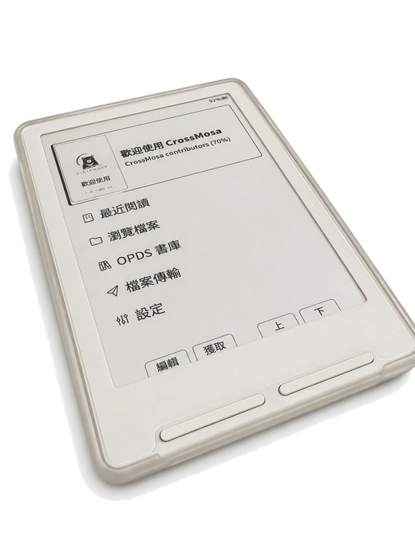

# 字型

CrossMosa 的中文字型分成兩種：

- **介面字型**：選單、書名、目錄用的字，內建在系統裡。
- **書的字型**：書的內文用的字，放在 SD 卡上，隨時可以換，不用重新刷機。

## 挑一套字型

| 字型 | 風格 | 適合 |
|---|---|---|
| **NotoSerifTC** 思源宋體 | 明體 | 長篇閱讀。建議先裝這套 |
| **RoundTC** 台灣圓體 | 圓體 | 筆畫末端圓潤，看久了比較不累。有粗體 |
| **NotoSansTC** 思源黑體 | 黑體 | 字小也清楚。有粗體 |
| **Iansui** 芫荽 | 硬筆楷書 | 像原子筆寫在紙上。沒有粗體，粗體會顯示成一般字 |
| **GuanKiapTsingKhai-90** 原俠正楷 | 楷書 | 2.0.x 的直排做法用，見下方「直排」 |
| IBMPlexSansTC | 黑體 | 保留的舊選項 |

每一套都收了兩萬多個漢字，台語文、古文、人名裡的冷僻字，幾乎都有。
2.0.1 之前下載的字型缺了一些符號，請重新下載。

全部裝完大約 430 MB。只裝一套也可以；第一次裝，建議整個資料夾複製。
空間不夠的話，每個字級是一個獨立的檔案，檔名裡的數字就是字級，例如 `NotoSerifTC_18.cpfont` 是 18 pt。

## 看不清小字：大字版

[字型包的下載頁](https://github.com/anki630/crossmosa/releases/tag/fonts-2026-09)另有一包大字版（明體、黑體、圓體），裝法一樣。
裝好之後，「閱讀字級」的清單會多出更大的尺寸。
字太大反而不好讀，一頁的字變少，就得一直翻頁，所以大字版停在剛好的大小。

## 給孩子：注音字型

每個字旁都有注音，給剛開始自己讀書的孩子。在 [`zhuyin-2026-09`](https://github.com/anki630/crossmosa/releases/tag/zhuyin-2026-09) 下載，裝法跟其他字型一樣。

注音字型的名稱是 ZhuyinKai（注音楷書），裝好之後在「閱讀字型」裡選它。需要 2.1.0-beta.5 或更新的版本。在沒看過的書上實測，注音引擎每千字平均約 4 字讀錯。

破音字判斷只在 ZhuyinKai 上有效，自己轉的注音字型會照字型本身的預設讀音顯示。

## 直排

2.1 測試版起有真正的直排：設定 → 閱讀器 → 文字設定 → 版面 → 文字方向。

直排時要楷書，請選 `Iansui`（芫荽），不要選原俠正楷。原俠正楷的字預先轉了 90 度，配上直排會每個字都躺著。

> 用 2.0.1 的話，可以用替代做法：選原俠正楷，再把螢幕轉成橫向，中文就會由上而下、由右而左排列。

## 放進 SD 卡

- SD 卡要是 FAT32 或 exFAT。
- 字型資料夾的名稱不能有空格，用底線代替。
- 放在 SD 卡最外層的 `fonts` 資料夾或 `.fonts` 資料夾都可以。

## 使用手冊

下載頁上的使用手冊《歡迎使用 CrossMosa》也放進 SD 卡。一邊讀一邊按，讀完就會用了。

---

# 遇到方塊字

**書名在檔案清單上是方塊、打開之後內文正常，是正常的。**
介面字型收的是常用字，不是全部的中文字；書的內文用 SD 卡上的字型，收了完整的中文字。
所以方塊只會出現在選單、檔名、書名和目錄，不會出現在內文。

碰到的話，請[開一張 Issue](https://github.com/anki630/crossmosa/issues)，標題寫「缺字」，內容貼上那個字本身，以及它出現在哪裡（選單、檔名、書名或內文）。補字是例行維護。

想知道介面字型收了哪些字、怎麼自己重做，看[給開發者](developers.md)。

---

# Fonts (English)

CrossMosa uses two kinds of Chinese fonts:

- **Interface fonts:** Used for menus, book titles, and tables of contents. They are built into the system.
- **Book fonts:** Used for book text. They are stored on the SD card, so you can change them at any time without reflashing.

## Choose a font family

| Font | Style | Best for |
|---|---|---|
| **NotoSerifTC** Noto Serif TC | Serif | Long-form reading. Recommended as your first font |
| **RoundTC** Taiwan Round | Rounded | Rounded stroke endings for comfortable reading. Includes bold |
| **NotoSansTC** Noto Sans TC | Sans serif | Clear at small sizes. Includes bold |
| **Iansui** | Handwritten | Looks like pen on paper. It has no bold face, so bold text appears regular |
| **GuanKiapTsingKhai-90** GuanKiapTsingKhai | Brush | The vertical-text workaround for 2.0.x. See “Vertical text” below |
| **IBMPlexSansTC** IBM Plex Sans TC | Sans serif | Kept as a legacy option |

Each family includes more than twenty thousand Han characters. It covers almost all uncommon characters found in written Taiwanese, classical Chinese, and names.

Fonts downloaded before 2.0.1 are missing some symbols. Download them again.

Installing every family takes about 430 MB. You can install only one family, but for your first installation, copying the complete folder is recommended.

If space is limited, each text size is a separate file. The number in the filename is the size. For example, `NotoSerifTC_18.cpfont` is 18 pt.

## Large-print fonts

The [font pack download page](https://github.com/anki630/crossmosa/releases/tag/fonts-2026-09) also includes a large-print pack with serif, sans-serif, and rounded fonts. Install it in the same way.

After installation, larger sizes appear under Settings → Reader → Reader Font Size.

Very large text can be harder to read because fewer characters fit on each page and you must turn pages more often. The large-print pack stops at a practical size.

## Zhuyin fonts for children

These fonts place zhuyin beside each character for children who are beginning to read independently. Download them from [`zhuyin-2026-09`](https://github.com/anki630/crossmosa/releases/tag/zhuyin-2026-09) and install them like any other font.

The font is named ZhuyinKai. After installation, select it under Settings → Reader → Reader Font Family. It requires version 2.1.0-beta.5 or later. In testing with previously unseen books, the zhuyin engine misread an average of about 4 characters per thousand.

Context-based pronunciation for characters with multiple readings works only with ZhuyinKai. Zhuyin fonts you convert yourself use the default pronunciations stored in the font.

## Vertical text

Starting with the 2.1 beta, CrossMosa supports true vertical text. Open Settings → Reader → Text Settings → Layout → Text Direction.

For a brush style in vertical text, choose `Iansui`. Do not choose GuanKiapTsingKhai. GuanKiapTsingKhai characters are pre-rotated by 90 degrees, so true vertical layout places every character on its side.

> On 2.0.1, you can use a workaround. Choose GuanKiapTsingKhai, then rotate the screen to landscape. Chinese text will run from top to bottom and right to left.

## Put fonts on the SD card

- Use an SD card formatted as FAT32 or exFAT.
- Font folder names cannot contain spaces. Use underscores instead.
- Put the font folders inside either `fonts` or `.fonts` in the root of the SD card.

## User guide

Also download the user guide *Welcome to CrossMosa* (in Traditional Chinese) from the download page and put it on the SD card. Read it while trying each control. By the end, you will know how to use the device.

---

## Seeing boxes?

**It is normal for a book title to appear as boxes in the file list while the book text displays correctly.**

The interface font contains common characters, not every Chinese character. Book text uses the complete Chinese fonts on the SD card. Boxes may therefore appear in menus, filenames, book titles, and tables of contents, but not in the book text.

If you find one, [open an issue](https://github.com/anki630/crossmosa/issues). Use “Missing character” as the title. Include the character itself and say where it appeared: a menu, filename, book title, or book text. Adding missing characters is routine maintenance.

To see which characters the interface font contains or learn how to rebuild it, see [For developers](developers.md#for-developers-english).
